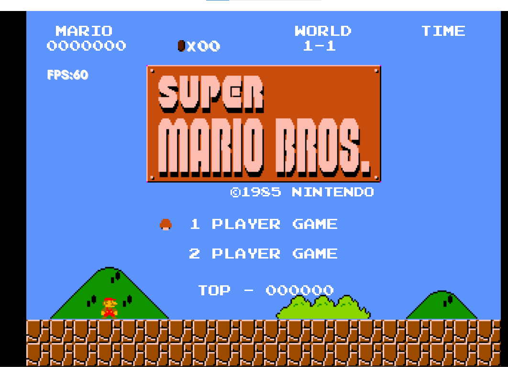

# godotgame

使用 Godot 引擎制作的一系列小游戏项目集合。每个文件夹包含一个独立的游戏工程。

## � 社交链接

- 掘金：https://juejin.cn/user/1003220454621063
- 个人博客（不更新了）：https://my.oschina.net/u/2000932/
- 知乎：https://www.zhihu.com/people/wang-er-32-96?utm_source=qq&utm_medium=social&utm_oi=551007046833733632

## �📚 项目概览

| 项目名称 | 游戏类型 | 引擎版本 | 状态 | 创建时间 | 描述 |
|---------|---------|---------|------|---------|------|
| [flappybird1](#flappybird1) | 休闲益智 | Godot 3.x | ✅ 已完成 | 2020.03 | Flappy Bird 经典游戏复刻 |
| [weseewe1](#weseewe1) | 跑酷 | Godot 3.x | ✅ 已完成 | 2020.08 | 像素风格跑酷游戏 |
| [tank1](#tank1) | 射击 | Godot 3.x | ✅ 已完成 | 2021.03 | 坦克大战游戏，支持双人对战 |
| [mario1](#mario1) | 平台动作 | Godot 3.x | ✅ 已完成 | 2021 | 超级马里奥兄弟完整复刻 |
| [balloonFight1](#balloonFight1) | 动作 | Godot 3.x | ⚠️ 进行中 | - | 气球大战游戏 |
| [pacman1](#pacman1) | 益智 | Godot 3.x | ⚠️ 进行中 | - | 吃豆人游戏 |
| [mario-new](#mario-new) | 平台动作 | Godot 4.x | 🚧 开发中 | 2026 | 基于 Godot 4 的马里奥重制版 |
| [myflappybird1](#myflappybird1) | 休闲益智 | Godot 2.x | 📦 存档 | - | 早期 Flappy Bird 版本 |

---

## 🎮 项目详情

### flappybird1

**Flappy Bird 经典游戏复刻**

- **操作方式**: 空格键或鼠标左键跳跃
- **游戏特性**:
  - 经典的 Flappy Bird 玩法
  - 随机生成的管道障碍物
  - 分数记录显示


---

### weseewe1

**像素风格跑酷游戏**

- **操作方式**: 空格键或鼠标跳跃
- **游戏特性**:
  - 像素艺术风格
  - 多种障碍物类型
  - 背景音乐和音效


---

### tank1

**坦克大战游戏**

- **操作方式**:
  - 1P: WASD 移动，J 发射子弹
  - 2P: 方向键移动，数字 0 发射子弹
  - 回车键: 暂停/开始
- **游戏特性**:
  - 双人对战模式
  - 内置地图编辑器（编辑完记得按下锁定，可以选择放在项目里面或外部文件夹）
  - 按键配置和地图选择
  - 冰块滑动功能
  - 多种敌人类型和奖励道具

**开发历史**:
- ✅ 完善游戏的碰撞检测，增加新的声音
- ✅ 实现冰块滑动功能


---

### mario1

**超级马里奥兄弟完整复刻**

- **操作方式**: WSAD 移动，Z 加速，X 跳跃
- **游戏特性**:
  - 全部 8 个世界，32 个关卡
  - 多种敌人类型（Goomba、Koopa、Plant、HammerBro、Bowser 等）
  - 物品系统（蘑菇、火焰花、星星、1UP 蘑菇等）
  - 地图编辑器
  - 完整音效和背景音乐




---

### balloonFight1

**气球大战游戏**

- **操作方式**:
  - 1P: WASD 移动，J 攻击
  - 2P: 方向键移动，数字 0 攻击
- **游戏特性**:
  - 双人对战模式
  - 气球破坏机制
  - 水面危险区域
  - 多种敌人类型（狐狸、小孩等）
  - 地图编辑器
  - 完整音效系统

> ⚠️ 最后功能尚未完成
---

### pacman1

**吃豆人游戏**（进行中）

- **游戏特性**:
  - 基础地图加载系统（JSON 格式）
  - 玩家移动逻辑（基于节点导航）
  - 幽灵基础框架
  - 音效系统（吃豆、吃幽灵、死亡等）

> ⚠️ 项目处于早期开发阶段，主要功能尚未完成

---

### mario-new

**基于 Godot 4 的超级马里奥重制版**（开发中）

本项目是基于旧项目 [mario1](mario1)（Godot 3）的 Godot 4 重制版，旨在利用新版引擎特性，同时保持原有的游戏手感和玩法体验。

- **技术栈**:
  - Godot 4.7 (GL Compatibility)
  - GDScript
  - Jolt Physics

- **✅ 已完成**:
  - 项目配置和输入映射
  - 核心类定义（gameType.gd, object.gd）
  - 基础场景创建

- **🔄 进行中**:
  - 全局游戏状态管理
  - 地图系统和碰撞检测
  - 玩家系统（移动、跳跃、状态变化）

- **❌ 未完成**:
  - 敌人系统
  - 物品系统
  - UI 和游戏流程
  - 音效系统

详细开发计划请参考 [DEVELOPMENT_PLAN.md](mario-new/DEVELOPMENT_PLAN.md)

---

### myflappybird1

**早期 Flappy Bird 版本**（存档）

使用 Godot 2.x 引擎开发的早期版本，作为技术存档保留。

---

## 🛠️ 技术栈

- **引擎**: Godot 3.x / 4.x
- **语言**: GDScript
- **渲染**: OpenGL / Direct3D
- **物理**: Godot Physics / Jolt Physics

## 📁 项目结构

每个游戏项目都包含以下典型结构：

```
project_name/
├── project.godot      # 项目配置文件
├── scenes/            # 场景文件 (.tscn)
├── scripts/           # GDScript 脚本 (.gd)
├── sprites/           # 精灵资源
├── sounds/            # 音效资源
└── levels/            # 关卡数据
```

## 🚀 运行方式

1. 下载并安装 [Godot 引擎](https://godotengine.org/)
2. 使用对应版本的 Godot 打开项目文件夹（Godot 3.x 用于旧项目，Godot 4.x 用于 mario-new）
3. 运行主场景（通常是 `welcome.tscn` 或 `main.tscn`）

## 📜 许可证

本项目仅供学习和参考使用。
