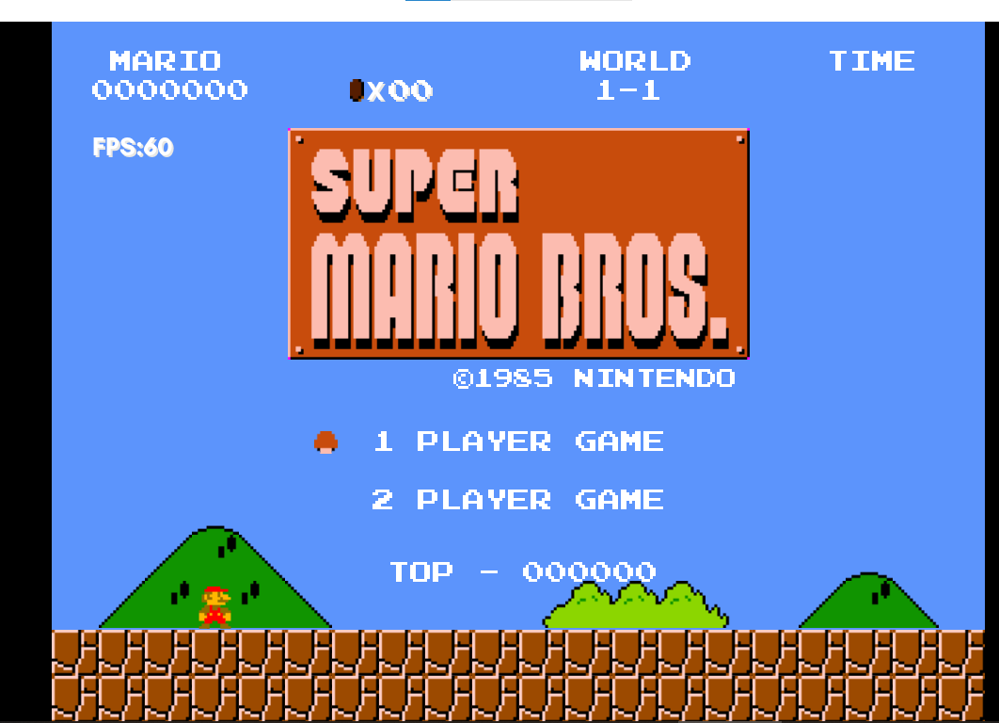
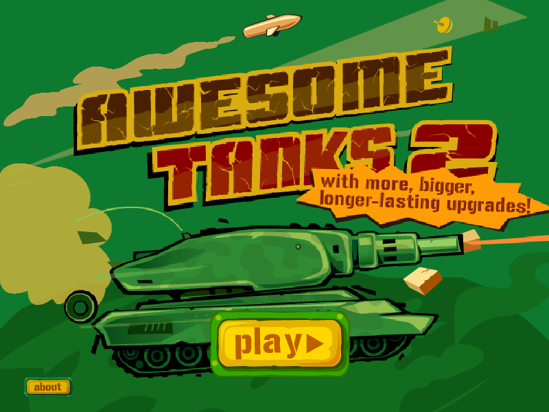

# godotgame

使用 Godot 引擎制作的一系列小游戏项目集合。每个文件夹包含一个独立的游戏工程。

## � 社交链接

- 掘金：https://juejin.cn/user/1003220454621063
- 个人博客（不更新了）：https://my.oschina.net/u/2000932/
- 知乎：https://www.zhihu.com/people/wang-er-32-96?utm_source=qq&utm_medium=social&utm_oi=551007046833733632

## �📚 项目概览

| 项目名称 | 游戏类型 | 引擎版本 | 状态 | 创建时间 | 描述 |
|---------|---------|---------|------|---------|------|
| [flappybird1](#flappybird1) | 休闲益智 | Godot 3.x | ✅ 已完成 | 2020.03 | Flappy Bird 经典游戏复刻 |
| [weseewe1](#weseewe1) | 跑酷 | Godot 3.x | ✅ 已完成 | 2020.08 | 像素风格跑酷游戏 |
| [tank1](#tank1) | 射击 | Godot 3.x | ✅ 已完成 | 2021.03 | 坦克大战游戏，支持双人对战 |
| [mario1](#mario1) | 平台动作 | Godot 3.x | ✅ 已完成 | 2021 | 超级马里奥兄弟完整复刻 |
| [balloonFight1](#balloonFight1) | 动作 | Godot 3.x | ⚠️ 进行中 | - | 气球大战游戏 |
| [pacman1](#pacman1) | 益智 | Godot 3.x | ⚠️ 进行中 | - | 吃豆人游戏 |
| [mario-new](#mario-new) | 平台动作 | Godot 4.x | 🚧 开发中 | 2026 | 基于 Godot 4 的马里奥重制版 |
| [2048](#2048) | 益智 | Godot 4.x | ✅ 已完成 | 2026 | 2048 数字合并游戏 |
| [tetris](#tetris) | 益智 | Godot 4.x | ✅ 已完成 | 2026 | 俄罗斯方块游戏 |
| [myflappybird1](#myflappybird1) | 休闲益智 | Godot 2.x | 📦 存档 | - | 早期 Flappy Bird 版本 |
| [AwesomeTanks2-godot](#awesometanks2-godot) | 射击 | Godot 4.7 + C# (.NET) | 🚧 开发中 | 2026 | 《Awesome Tanks 2》H5 原版的 Godot 复刻，15 关战役 + 关卡编辑器 |

---

## 🎮 项目详情

### flappybird1

**Flappy Bird 经典游戏复刻**

- **操作方式**: 空格键或鼠标左键跳跃
- **游戏特性**:
  - 经典的 Flappy Bird 玩法
  - 随机生成的管道障碍物
  - 分数记录显示


---

### weseewe1

**像素风格跑酷游戏**

- **操作方式**: 空格键或鼠标跳跃
- **游戏特性**:
  - 像素艺术风格
  - 多种障碍物类型
  - 背景音乐和音效


---

### tank1

**坦克大战游戏**

- **操作方式**:
  - 1P: WASD 移动，J 发射子弹
  - 2P: 方向键移动，数字 0 发射子弹
  - 回车键: 暂停/开始
- **游戏特性**:
  - 双人对战模式
  - 内置地图编辑器（编辑完记得按下锁定，可以选择放在项目里面或外部文件夹）
  - 按键配置和地图选择
  - 冰块滑动功能
  - 多种敌人类型和奖励道具

**开发历史**:
- ✅ 完善游戏的碰撞检测，增加新的声音
- ✅ 实现冰块滑动功能


---

### mario1

**超级马里奥兄弟完整复刻**

- **操作方式**: WSAD 移动，Z 加速，X 跳跃
- **游戏特性**:
  - 全部 8 个世界，32 个关卡
  - 多种敌人类型（Goomba、Koopa、Plant、HammerBro、Bowser 等）
  - 物品系统（蘑菇、火焰花、星星、1UP 蘑菇等）
  - 地图编辑器
  - 完整音效和背景音乐




---

### balloonFight1

**气球大战游戏**

- **操作方式**:
  - 1P: WASD 移动，J 攻击
  - 2P: 方向键移动，数字 0 攻击
- **游戏特性**:
  - 双人对战模式
  - 气球破坏机制
  - 水面危险区域
  - 多种敌人类型（狐狸、小孩等）
  - 地图编辑器
  - 完整音效系统

> ⚠️ 最后功能尚未完成
---

### pacman1

**吃豆人游戏**（进行中）

- **游戏特性**:
  - 基础地图加载系统（JSON 格式）
  - 玩家移动逻辑（基于节点导航）
  - 幽灵基础框架
  - 音效系统（吃豆、吃幽灵、死亡等）

> ⚠️ 项目处于早期开发阶段，主要功能尚未完成

---

### mario-new

**基于 Godot 4 的超级马里奥重制版**（开发中）

本项目是基于旧项目 [mario1](mario1)（Godot 3）的 Godot 4 重制版，旨在利用新版引擎特性，同时保持原有的游戏手感和玩法体验。

- **技术栈**:
  - Godot 4.7 (GL Compatibility)
  - GDScript
  - Jolt Physics

- **✅ 已完成**:
  - 项目配置和输入映射
  - 核心类定义（gameType.gd, object.gd）
  - 基础场景创建

- **🔄 进行中**:
  - 全局游戏状态管理
  - 地图系统和碰撞检测
  - 玩家系统（移动、跳跃、状态变化）

- **❌ 未完成**:
  - 敌人系统
  - 物品系统
  - UI 和游戏流程
  - 音效系统

详细开发计划请参考 [DEVELOPMENT_PLAN.md](mario-new/DEVELOPMENT_PLAN.md)

---

### 2048

**2048 数字合并游戏**

基于 Godot 4 实现的经典 2048 游戏，包含开始界面与游戏界面两个场景。

- **操作方式**:
  - 方向键 / WASD: 上下左右移动并合并同值方块
  - R: 重新开始
  - ESC: 返回主菜单
- **游戏特性**:
  - 4×4 棋盘，经典 2048 配色（每个数字对应不同颜色）
  - 移动方块带平滑滑动动画（ease-out 减速）
  - 同值方块合并时带"pop"弹出动画
  - 新生成方块从 0 缩放出现
  - 每步随机生成新方块（90% 概率为 2，10% 概率为 4）
  - 实时得分显示、胜利（达到 2048）与游戏结束判定

- **项目结构**:
  ```
  2048/
  ├── project.godot          # Godot 4 配置, 500x700 窗口
  ├── icon.svg
  ├── scene/
  │   ├── welcome.tscn       # 开始界面
  │   └── game.tscn          # 游戏界面
  └── script/
      ├── welcome.gd         # 开始逻辑
      └── game.gd            # 游戏逻辑 (网格 + 滑动合并 + 动画)
  ```

---

### tetris

**俄罗斯方块游戏**

基于 Godot 4 实现的经典俄罗斯方块，包含开始界面与游戏界面两个场景。

- **操作方式**:
  - ← → / A D: 左右移动
  - ↑ / W: 旋转（带墙踢偏移）
  - ↓ / S: 软降（10 倍速）
  - 空格: 硬降（每格 +2 分）
  - P: 暂停 / 继续
  - R: 重新开始
  - ESC: 返回主菜单
- **游戏特性**:
  - 10 列 × 20 行标准棋盘
  - 7 种经典方块（I/O/T/S/Z/J/L），用 4×4 矩阵 + 颜色统一描述
  - 顺时针旋转 + 墙踢偏移（O 方块不旋转）
  - 消行计分：1/2/3/4 行分别 100/300/500/800 × 等级
  - 等级随消行数提升，下落速度逐级加快
  - "下一个"方块预览（自动居中显示）
  - 网格风格背景（棋盘格交替明暗）和方块（实色 + 内部十字网格 + 高光边）
  - **影子方块**：实时显示当前方块自然落点，半透明 + 虚线轮廓
  - **消行动画**：光从左→右 或 右→左 随机方向扫过满行，扫到的方块闪白缩小消失
  - **暂停功能**：半透明遮罩 + "已暂停"居中文字，暂停期间屏蔽移动输入

- **项目结构**:
  ```
  tetris/
  ├── project.godot          # Godot 4 配置, 460x740 窗口
  ├── icon.svg
  ├── scene/
  │   ├── welcome.tscn       # 开始界面
  │   └── game.tscn          # 游戏界面
  └── script/
      ├── welcome.gd         # 开始逻辑
      └── game.gd            # 游戏逻辑 (方块/旋转/消行动画/影子/暂停)
  ```

---

### myflappybird1

**早期 Flappy Bird 版本**（存档）

使用 Godot 2.x 引擎开发的早期版本，作为技术存档保留。

---

### AwesomeTanks2-godot

**《Awesome Tanks 2》H5 原版的 Godot 复刻版**（开发中）

以 H5 版《Awesome Tanks 2》（`awesome_tanks_2.js`）为蓝本，按原版逐个功能复刻：
数值、关卡地图、敌人 AI、武器手感、结算流程都尽量与 H5 保持一致。

- **操作方式**:
  - W / A / S / D: 移动
  - 鼠标: 瞄准炮塔
  - 鼠标左键: 开火（火焰喷射器 / 激光 / 电枪按住即持续输出；火箭按一下发射制导导弹，再按一下引爆）
  - Q / E: 上一个 / 下一个武器
  - ESC: 暂停
  - 制导火箭飞行期间镜头会跟着导弹，玩家不能开车，导弹消失后镜头与操作权自动还给玩家

- **游戏特性**:
  - **15 关战役**：砖墙 / 木板 / 木箱 / 油桶 / 闸门等可破坏场景，油桶连锁爆炸，砖墙挡子弹、木板会被烧穿
  - **10 种武器**：机枪、霰弹枪、弹跳弹、火焰喷射器、加农炮、电枪（连锁闪电）、制导火箭、激光、轨道炮、地雷
  - **升级商店**：装甲 / 速度 / 炮塔转速 / 视野 4 项属性 + 各武器等级与弹药购买，结算收益入账并跨关保留弹药
  - **敌人**：生成器 7 种（周期产出坦克，共 6 只）、固定炮塔 8 种、机动坦克 9 种，全部带寻路 AI（警戒链 / 追击 / 调查声响 / 冰冻 / 灼烧）
  - **奖励掉落**：金币、医疗包、冰冻、炸弹、各类弹药、小敌人，敌人清空后全场吸附结算
  - **黑雾视野**：按炮塔朝向发射扇形视野射线揭开迷雾，制导火箭期间视野跟着导弹
  - **结算流程**：与 H5 一致 —— 面板 2 秒后淡入、胜利 4.5 秒后自动继续；结算期间世界不暂停，但玩家失去操作
  - **关卡编辑器**：内置编辑器可以自己画地图并保存为自定义关卡

- **技术栈**:
  - Godot 4.7（GL Compatibility）+ **C# (.NET)** + GDScript
  - 寻路用 EasyStar，C# 重写（`scripts/pathfinding/*.cs`），GDScript 侧只留一层薄封装
  - 场景 + 脚本一一对应，可复用组件（血条 / 奖励物 / 武器 / 状态机）都是独立 `.tscn` 再实例化到父场景

- **项目结构**:
  ```
  AwesomeTanks2-godot/
  ├── project.godot          # Godot 4.7 配置（800x600，C# 项目）
  ├── AwesomeTanks2.csproj   # C# 工程（需 .NET 版 Godot 打开）
  ├── scenes/                # 场景（Level / Title / LevelSelect / Upgrades / LevelEditor …）
  ├── scripts/               # GDScript + C#（tank / enemies / weapons / objects / level / ui / pathfinding）
  ├── data/levels.gd         # 15 关 ASCII 地图数据
  ├── sprites/  sounds/      # 贴图（atlas 切片为 .tres）与音效
  ├── docs/                  # 开发笔记（敌人 AI 分析等）
  └── tools/                 # 资源导入等一次性工具
  ```

> ⚠️ 这是 C# 项目：必须用 **.NET（mono）版 Godot** 打开/运行，标准版加载不了 C# 脚本（`dotnet build` 需要本机有对应 .NET SDK）



---

## 🛠️ 技术栈

- **引擎**: Godot 2.x / 3.x / 4.x（AwesomeTanks2-godot 用的是 Godot 4.7 的 .NET 版）
- **语言**: GDScript / C#（AwesomeTanks2-godot 的寻路为 C#）
- **渲染**: OpenGL / Direct3D
- **物理**: Godot Physics / Jolt Physics

## 📁 项目结构

每个游戏项目都包含以下典型结构：

```
project_name/
├── project.godot      # 项目配置文件
├── scenes/            # 场景文件 (.tscn)
├── scripts/           # GDScript 脚本 (.gd)
├── sprites/           # 精灵资源
├── sounds/            # 音效资源
└── levels/            # 关卡数据
```

## 🚀 运行方式

1. 下载并安装 [Godot 引擎](https://godotengine.org/)
2. 使用对应版本的 Godot 打开项目文件夹（Godot 3.x 用于旧项目，Godot 4.x 用于 mario-new、2048、tetris）
3. **AwesomeTanks2-godot 需要 Godot 4.7 的 .NET(mono) 版**，且本机装好对应 .NET SDK；打开后先 `dotnet build`，再用编辑器运行主场景
4. 运行主场景（通常是 `welcome.tscn` 或 `main.tscn`）

## 📜 许可证

本项目仅供学习和参考使用。
